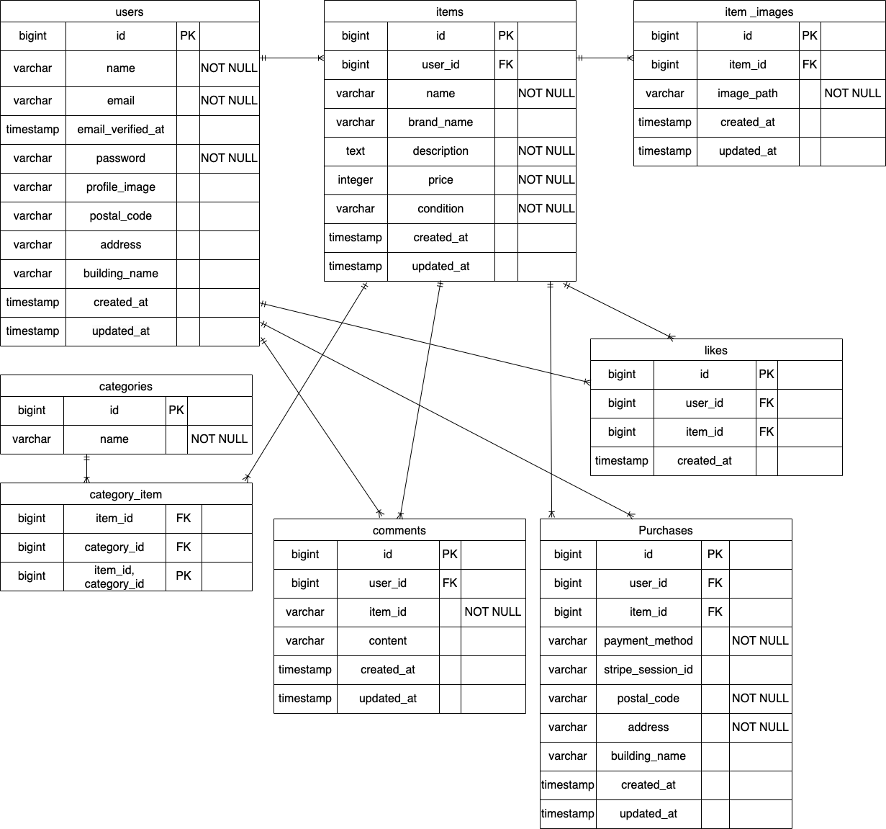

# Marketplace-Application

## 環境構築

### Docker ビルド
1. git clone git@github.com:uedarina24-hue/Marketplace-Application.git
2. docker-compose up -d --build

### Laravel 環境構築
1. docker-compose exec php bash
2. composer install
3. cp .env.example .env
4. .env ファイルの変更

```
　DB_HOSTをmysqlに変更
　DB_DATABASEをlaravel_dbに変更
　DB_USERNAMEをlaravel_userに変更
　DB_PASSをlaravel_passに変更
　MAIL_FROM_ADDRESSに送信元アドレスを設定
```

5. php artisan key:generate
6. php artisan migrate
7. php artisan db:seed
8. storage画像用ディレクトリ作成
* mkdir -p storage/app/public/items
* mkdir -p storage/app/public/profiles
9. php artisan storage:link
10. php artisan test

## PHPunitを用いたテスト手順
1. docker-compose exec mysql bash
2. mysql -u root -p
3. CREATE DATABASE demo_test;
4. SHOW DATABASES;
5. cp .env .env.testingに下記作成

```
APP_ENV=testing
APP_KEY=（php artisan key:generate --env=testing で自動生成されます）
DB_CONNECTION=mysql
DB_HOST=mysql
DB_PORT=3306
DB_DATABASE=demo_test
DB_USERNAME=root
DB_PASSWORD=root
```
6. php artisan key:generate --env=testing
7. php artisan config:clear
8. php artisan migrate --env=testing
9. 各テストコードを実行する

## テーブル仕様

### users テーブル

| カラム名           | 型          　　| primary key | unique key | not null | foreign key |
| ----------------- | --------------- | ----------- | ---------- | -------- | ----------- |
| id                | unsigned bigint | ◯           |            | ◯        |             |
| name              | string          |             |            | ◯        |             |
| email             | string          |             | ◯          | ◯        |             |
| email_verified_at | timestamp       |             |            |          |             |
| password          | string          |             |            | ◯        |             |
| profile_image     | string          |             |            |          |             |
| postal_code       | string          |             |            |          |             |
| address           | string          |             |            |          |             |
| building_name     | string          |             |            |          |             |
| created_at        | timestamp       |             |            |          |             |
| updated_at        | timestamp       |             |            |          |             |


### items テーブル

| カラム名    | 型               | primary key | unique key | not null | foreign key |
| ----------- | --------------- | ----------- | ---------- | -------- | ----------- |
| id          | unsigned bigint | ◯           |            | ◯        |             |
| user_id     | unsigned bigint |             |            | ◯        | users(id)   |
| name        | string          |             |            | ◯        |             |
| brand_name  | string          |             |            |          |             |
| description | text            |             |            | ◯        |             |
| price       | integer         |             |            | ◯        |             |
| condition   | string          |             |            | ◯        |             |
| created_at  | timestamp       |             |            |          |             |
| updated_at  | timestamp       |             |            |          |             |


### item_images テーブル

| カラム名    | 型               | primary key | unique key | not null | foreign key |
| ---------- | --------------- | ----------- | ---------- | -------- | ----------- |
| id         | unsigned bigint | ◯           |            | ◯        |             |
| item_id    | unsigned bigint |             |            | ◯        | items(id)   |
| image_path | string          |             |            | ◯        |             |
| created_at | timestamp       |             |            |          |             |
| updated_at | timestamp       |             |            |          |             |


### categories テーブル
|カラム名| 型             | primary key | unique key | not null | foreign key |
| ---- | --------------- | ----------- | ---------- | -------- | ----------- |
| id   | unsigned bigint | ◯           |            | ◯        |             |
| name | string          |             | ◯          | ◯        |             |


### category_item テーブル

| カラム名     | 型               | primary key | unique key | not null | foreign key    |
| ----------- | --------------- | ----------- | ---------- | -------- | -------------- |
| item_id     | unsigned bigint | ◯           |            | ◯        | items(id)      |
| category_id | unsigned bigint | ◯           |            | ◯        | categories(id) |


### likes テーブル

| カラム名    | 型               | primary key | unique key | not null | foreign key |
| ---------- | --------------- | ----------- | ---------- | -------- | ----------- |
| id         | unsigned bigint | ◯           |            | ◯        |             |
| user_id    | unsigned bigint |             |            | ◯        | users(id)   |
| item_id    | unsigned bigint |             |            | ◯        | items(id)   |
| created_at | timestamp       |             |            |          |             |


### comments テーブル

| カラム名    | 型               | primary key | unique key | not null | foreign key |
| ---------- | --------------- | ----------- | ---------- | -------- | ----------- |
| id         | unsigned bigint | ◯           |            | ◯        |             |
| user_id    | unsigned bigint |             |            | ◯        | users(id)   |
| item_id    | unsigned bigint |             |            | ◯        | items(id)   |
| content    | string          |             |            | ◯        |             |
| created_at | timestamp       |             |            |          |             |
| updated_at | timestamp       |             |            |          |             |

### purchases テーブル

| カラム名           | 型               | primary key | unique key | not null | foreign key |
| ----------------- | --------------- | ----------- | ---------- | -------- | ----------- |
| id                | unsigned bigint | ◯           |            | ◯        |             |
| user_id           | unsigned bigint |             |            | ◯        | users(id)   |
| item_id           | unsigned bigint |             | ◯          | ◯        | items(id)   |
| payment_method    | string          |             |            | ◯        |             |
| stripe_session_id | string          |             | ◯          |          |             |
| postal_code       | string          |             |            | ◯        |             |
| address           | string          |             |            | ◯        |             |
| building_name     | string          |             |            |          |             |
| created_at        | timestamp       |             |            |          |             |
| updated_at        | timestamp       |             |            |          |             |


## ER図


## ログイン情報（Seederによる作成）

### 一般ユーザー（認証済み）
* メールアドレス：yamada.tarou@example.com /password
* メールアドレス：yamada.hanako@example.com /password
### 一般ユーザー（未認証）
* メールアドレス：suzuki.ichiro@example.com /password

※初回ログイン時に手動送信によるメール認証が必要です

## 使用技術

* PHP 7.4.9
* Laravel 8.83.8
* MySQL 8.0.26
* nginx 1.21.1
* MailHog latest

## URL

* 開発環境：http://localhost/
* Register：http://localhost/register
* Login：http://localhost/login
* phpMyAdmin：http://localhost:8080/
* MailHog：http://localhost:8025/

## ダミーデータ作成・画像
| 用途           | public パス               | storage パス                  |
| -------------- | ------------------------ | ---------------------------- |
| 商品一覧画像    | `public/images/items`    | `storage/app/public/items`   |
| プロフィール画像 | `public/images/profiles` | `storage/app/public/profiles`|

## Stripe決済設定
本アプリではオンライン決済に Stripe を使用しています。
ローカル環境で決済機能を利用するために、以下の設定を行ってください。

1. Stripeアカウント作成　　
* Stripe公式サイトでアカウントを作成してください。
* https://stripe.com/jp
* ダッシュボードから テスト用APIキー を取得します。

2. .env に API Key を設定
```
STRIPE_KEY=pk_test_xxxxxxxxxxxxxxxxx
STRIPE_SECRET=sk_test_xxxxxxxxxxxxxxxxx
```
※ Stripe ダッシュボードの 開発者 → APIキー から取得できます。

3. テスト用カード番号
```
カード番号	4242 4242 4242 4242
有効期限	任意の未来日（例: 12/34）
CVC	任意（例: 123）
郵便番号	任意（例: 12345）
```
4. 決済テスト手順
* ユーザーでログイン
* 商品詳細ページから「購入」ボタンを押す
* 支払方法で カード決済 を選択
* Stripeのテストカード番号を入力
* 決済完了後、購入情報が purchases テーブルに保存される

## 注意事項
1. 支払方法はstripeを使っているため、コンビニ支払では購入完了できないため、カード決済のみを購入完了としている。
2. テストケースでもカード決済のみでテストを行っている。
3. テストケースではユーザ登録後メール認証からプロフールに入るのでテストの流れが異なります。
4. 自分の出品に関して、自分の出品にはいいねを押せない、表示しないとは書いてないが、規制ルールを設けて、自分の出品にはいいね押せない、マイリストにも表示しないこととした。
5. 売り切れ商品に関して、売り切れた商品にコメントできない、いいね押せないとは書いてないが、規制ルールを設けて、コメントもいいねも押せないようにした。